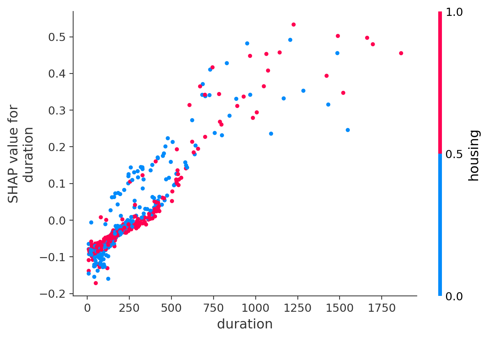
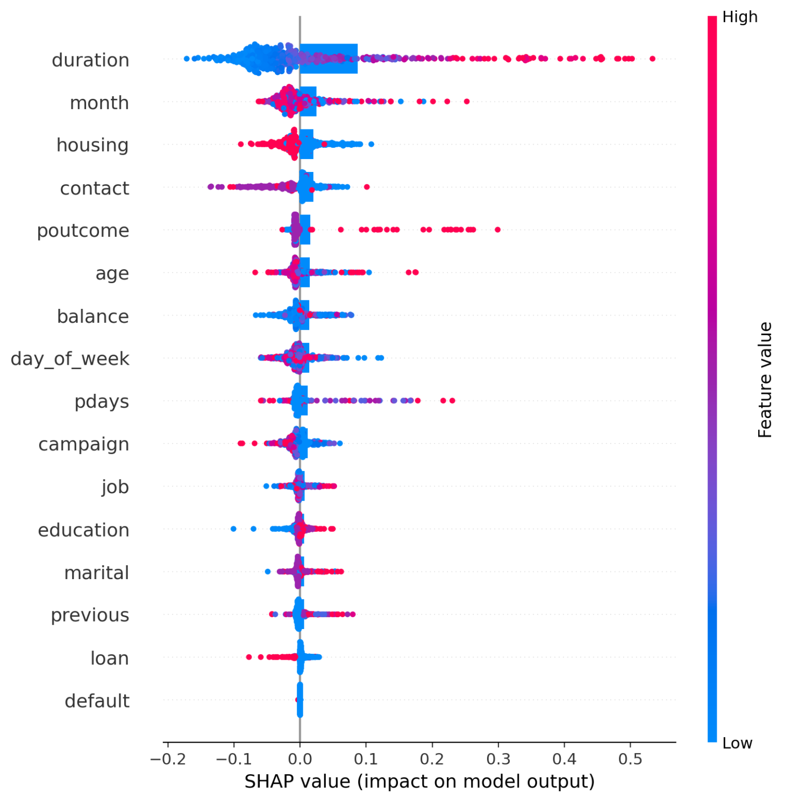
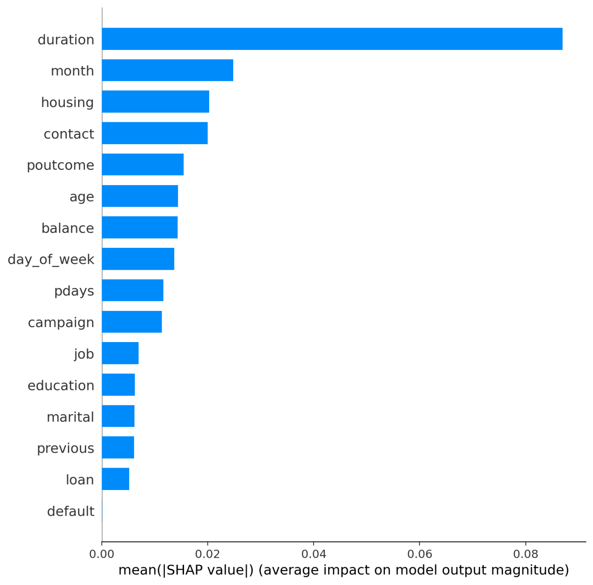

# SHAP
## 🔍 What is SHAP?

**SHAP (SHapley Additive exPlanations)** is a unified framework for interpreting machine learning model predictions. It aims to answer the fundamental question:

> "How much did each feature contribute to a specific prediction?"

SHAP combines ideas from game theory and local explanations to attribute the output of a model to its input features in a consistent and theoretically sound way.

---

## 🧠 The Theory Behind SHAP: Shapley Values

SHAP is based on **Shapley values** from cooperative game theory, introduced by Lloyd Shapley in 1953. In this setting:

- The **"game"** is the model prediction task.
- The **"players"** are the features (input variables).
- The **"payout"** is the prediction for a given instance.

The Shapley value fairly distributes the total payout (the model prediction) among all the features based on their contributions.

---

## 📐 Mathematical Definition

For a model $$f(x)$$ and an input instance $$x = (x_1, x_2, ..., x_n)$$, the Shapley value $$\phi_i$$ for feature $$i$$ is defined as:

$$
\phi_i = \sum_{S \subseteq N \setminus \{i\}} \frac{|S|! (|N|-|S|-1)!}{|N|!} \left[ f_{S \cup \{i\}}(x_{S \cup \{i\}}) - f_S(x_S) \right]
$$

Where:
- $$N$$: the set of all features
- $$S$$: a subset of features that does **not** include feature $$i$$
- $$f_S(x_S)$$: model prediction using only the features in subset $$S$$
- $$\phi_i$$: the marginal contribution of feature $$i$$, averaged over all possible subsets $$S$$

**Intuition:**  
We average the change in the model output when feature $$i$$ is added to all possible subsets of features.

---

## ⚙️ SHAP in Practice

- Calculating exact Shapley values is **computationally expensive** (exponential time).
- SHAP introduces efficient approximations:
  - **TreeSHAP** for tree-based models (e.g., XGBoost, LightGBM, Random Forest) — runs in polynomial time.
  - **KernelSHAP** for model-agnostic use — uses sampling-based methods.

---

## ✅ Desirable Properties of SHAP

SHAP values satisfy important axioms:

1. **Additivity:**
   $$f(x) = E[f(x)] + \sum_i \phi_i$$
   The model prediction equals the expected value plus the sum of SHAP values.

2. **Consistency:**  
   If a model changes such that a feature's contribution increases, its SHAP value should not decrease.

3. **Null player:**  
   If a feature has no impact on the model, its SHAP value will be zero.

---

## 📊 Why Use SHAP?

SHAP provides:
- **Local explanations**: for individual predictions
- **Global insights**: by aggregating local SHAP values
- **Fair attribution**: based on strong theoretical guarantees

It is one of the most powerful tools for **interpretable machine learning** today.

---

### In This Project

I used SHAP to analyze the Bank Marketing model predictions. The plots included in this repository:

- **SHAP Summary Plot:** Shows overall feature importance and how feature values relate to their impact on the prediction.
- **SHAP Dependence Plot:** Displays how the effect of one feature depends on the value of another.
- **SHAP Value Sort Plot:** Visualizes individual prediction explanations sorted by their SHAP values.

These visualizations help users understand why the model makes certain predictions and which factors are the most influential.

---

If you want to learn more about SHAP, visit the official documentation:  
[https://shap.readthedocs.io/en/latest/](https://shap.readthedocs.io/en/latest/)

# Bank Marketing Dataset and Visualization App

I have used the **Bank Marketing** dataset from the [UCI Machine Learning Repository](https://archive.ics.uci.edu/ml/datasets/Bank+Marketing) for my project.

Based on this dataset, I developed a user-friendly web application that allows users to explore the data and visualize outputs through interactive charts.

You can access the app here:  
[https://shapbanking.streamlit.app/](https://shapbanking.streamlit.app/)

---

## Project Files

- `SHAP_bank_marketing_app.py` — The main Streamlit application script for data loading, modeling, and visualization.
- `SHAP_Dependence_Plot.png` — A SHAP dependence plot showing feature interactions and effects.
- `SHAP_Summary_Plot.png` — A SHAP summary plot demonstrating feature importance across the dataset.
- `SHAP_value_sort.png` — A plot showing sorted SHAP values for model interpretability.

---

## Visualization Examples

### SHAP Dependence Plot

### SHAP Summary Plot

### SHAP Value Sort Plot

---

**Dataset Citation:**  
Moro, S., Rita, P., & Cortez, P. (2014). Bank Marketing [Dataset]. UCI Machine Learning Repository. https://doi.org/10.24432/C5K306

---

Feel free to try the app and explore the data interactively!

